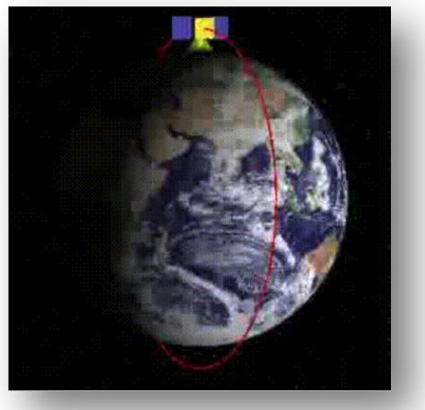
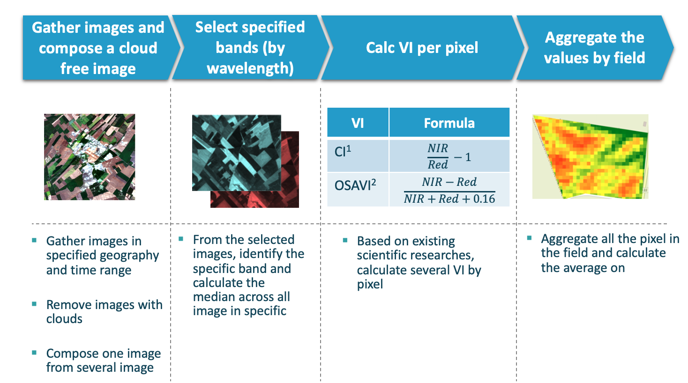
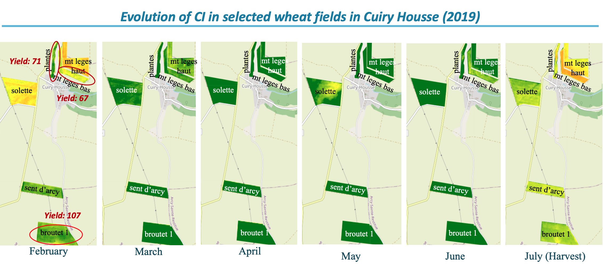
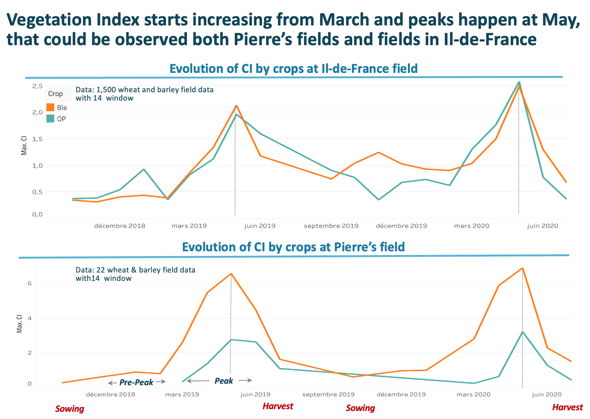
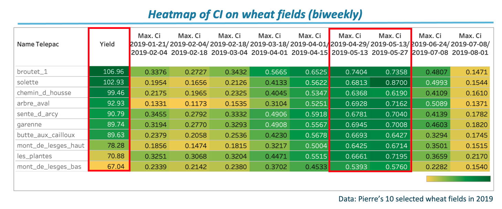
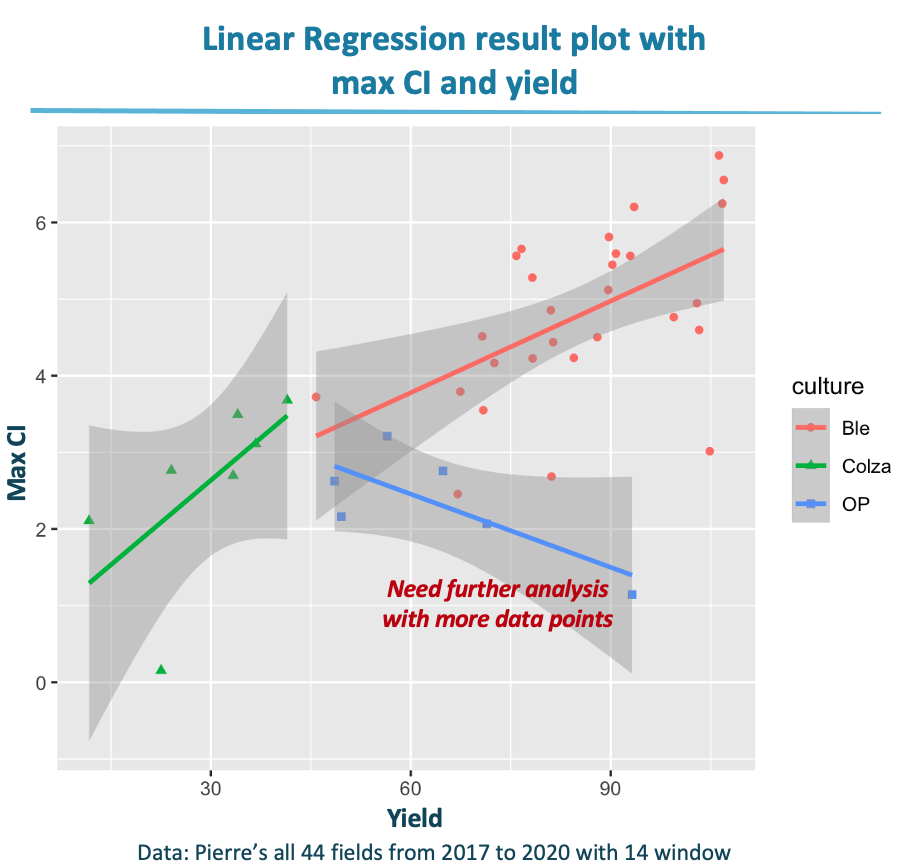
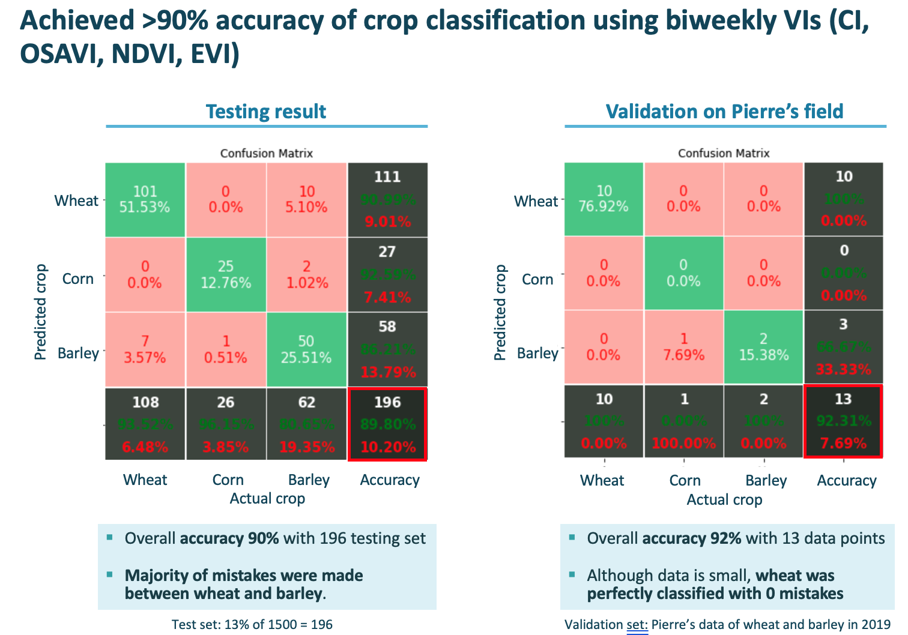
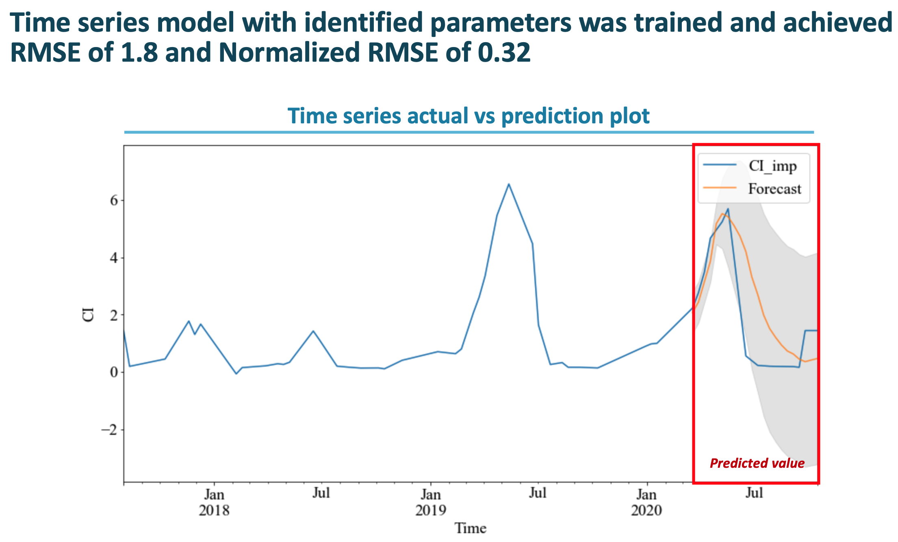

# Crop Yield Prediction with Satellite Image
<p align="center">

</p>

<!-- markdown-toc start - Don't edit this section. Run M-x markdown-toc-refresh-toc -->

**Table of Contents**
- [Objective](#objective)
- [About our pipeline](#about-our-pipeline)
  - [Description](#description-of-pipeline)
  - [Data acquisition mechanism](#data-acquisition-mechanism)
  - [How to run the pipline](#how-to-run-the-pipeline)
- [Enabled work results](enabled-work-examples)
  - [Derive insights](#derive-insights)
  - [Crop-classification](#crop-classification)
<!-- markdown-toc end -->


# Objective
This project's objective is to mitigate the supply chain risks in food and agricultural sectors by predicting crop yields in France. <br>
The pipeline is to be integraged into [Agrisight®](https://agrisight.emerton-data.com/?page_id=320&lang=en) by [Emerton Data®](https://www.emerton-data.com/)

# About our pipeline

## Descroption
Although there are 2,200 satellites flying nowadays, usage of satellite image (remote sensing data) is limited due to the scientific and technical difficulties to acquired and process them properly. This pipleline will allow user to automatically acquire and process Sentinel-2 data, and calculate vegetation indices by running one single script.<br>
With this, your team will be capable to start analysing the data right away and run any models you wish.<br>
Desired time range, area, and kind of vegetation indices is easily configurable thanks to the structure.<br><br>
As the code is highly confidential, if you would like to have a demo of beta version, please contact us.

## Data acquisition mechanism

<p align="center">

</p>

## How to run
Pipeline is runnable in any environment with a virtual environment.<br>
First, create log file
```python
mkdr logs
```
Initialize the vertual environment
```python
pipenv install
pipenv shell
```

Run code
```python
python run.py 
```

# Enabled works examples
## Derive insights
<p align="center">

</p>
<br><br>

<p align="center">

</p>
<br><br>

<p align="center">

</p>
<br><br>

<p align="center">

</p>
<br><br>

## Crop classification
<p align="center">

</p>
<br><br>

## Crop yield prediction
<p align="center">

</p>
